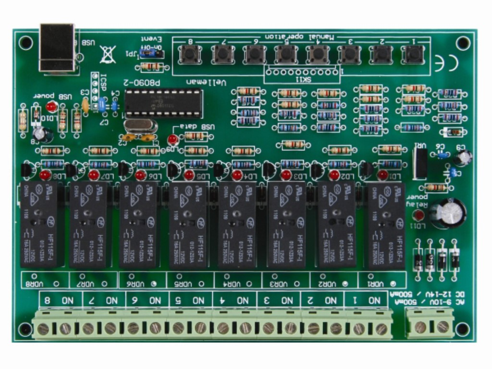

# Velleman K8090

## Requirements

- Make sure [```python```](https://www.python.org/) is installed
- Make sure ```pyserial``` is available

```bash
$ pip install pyserial
```

- Add you user to the ```dialout``` group

```bash
$ sudo usermod -aG dialout $USER
```

## Info

- The device port appears as a USB CDC/ACM serial device:
    - Linux e.g. /dev/ttyACM0)
    - Windows e.g. COM3

## Serial protocol

- Packet structure: 7-byte data packets
    - Byte 1 - 0x04 - Start byte (STX)
    - Byte 2 - 0x__ - Command
        - 0x11 - Relay ON
        - 0x12 - Relay OFF
        - 0x14 - Relay toggle
        - 0x18 - Query relay status
    - Byte 3 - 0x__ - Which relay(s)
        - E.g. 0x01 - For relay 1
        - E.g. 0x21 - For relay 1 and 6
        - E.g. 0xFF - For ALL relays
    - Byte 4 & 5 - Parameters - Extra byte for timers or settings, 0x00 if not used
    - Byte 6 - Checksum - Two's complement of the sum of the packet bytes
    - Byte 7 - 0x0F - End byte (ETX)

---

There are more commands, but not implemented at this point.

## Board


